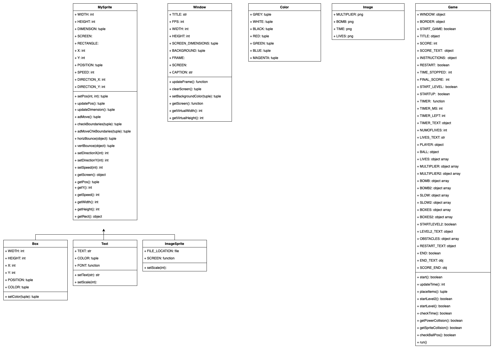
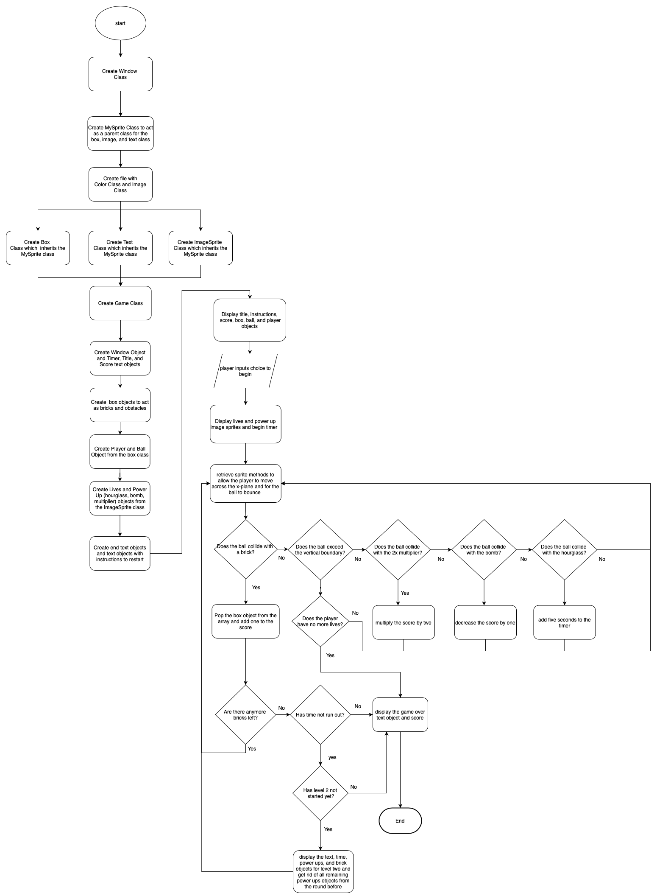

# CSE3130-Project

##Brick Breaker Project
This program is a recreation of the game brick breaker. The goal of the game is for the player to be able to break all of the bricks and collect the most points possible by moving the ball with their paddle before the timer has run up or the ball exceeding the vertical boundary.

## Planning
When planning to create the program, I designed UML tables and a flowchart to help with programming the classes and methods needed for the program. 

-UML Tables: 
    

-Flowchart:
    

Also, when planning for the collision function, I referred to a youtube video(https://www.youtube.com/watch?v=1_H7InPMjaY), which helped me with understanding the logic of how to program for the collisions so the objects are able to bounce off of each other. 

## Added features
The additional features I added to the program were the addition of a timer, lives, and power ups:

- For the lives feature, the player is given three lives when initializing the first round which are displayed at the top. If the player exceeds the vertical boundary, a life will be lost. If the player runs out of lives the game will come to a stop and display game over and the player's score.

- For the timer feature, a timer is displayed in the top right corner which counts down from the alotted time for each of the round. If the player exceeds the vertical boundary and has another life to begin again, the timer will change and begin counting down at the time of when it exceeding the vertical boundary. If the timer reaches zero, the game will stop and display game over and the player's score.

- For the power ups feature, I included three powerups which are displayed randomly across the gameplay screen that the player can interact with. If the player collides with the hourglass, five seconds will be added to the timer. If the player collides with the x2 multiplier, their score will be doubled. If the player collides with the bomb, a point will be taken off from their score.

## External files
- Requires Python 3.8 and Pygame 2.0.0.dev6 to function (other versions of Pygame may work, but this program was made testing with Pygame 2.0.0.dev6)

## How to run Program
- Install Python 3.8 and Pygame 2.0.0.dev6 if not installed
- Retrieve all files from git (CSE3130-Project) and upload onto Pycharm
- Run the game.py file 
- Follow instructions given on the menu upon running the program

### Troubleshooting
When running the program, there may be issues with the initialization of the program. If this occurs, try to press the spacebar more than once to begin the program.